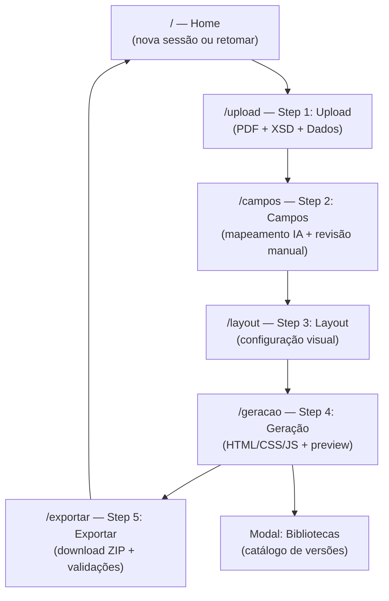

# Frontend Specification — Migrador Planetexpress → HTML/Knockout.js

**Versão:** 1.0
**Data:** 2026-03-10
**Autora:** @ux-design-expert (Uma)
**Status:** Aprovado — pronto para implementação
**Stack:** Vue 3 + TypeScript + Vite + Pinia + Vue Router + PDF.js + Monaco Editor + Chart.js + idb
**Backend:** FastAPI em Railway
**Plataforma:** Web app puro — browser Chrome/Edge, sem instalação

---

## 1. Introdução e Objetivos de UX

### 1.1 Propósito

Especificação técnica de frontend para o Migrador Planetexpress → HTML/Knockout.js. Define arquitetura de componentes, fluxos de usuário, estados de tela, design system e contratos de integração com o backend FastAPI.

### 1.2 Persona Principal

**Operador Técnico**

- Acessa a ferramenta via URL de servidor (Chrome/Edge moderno)
- Conhece o domínio de documentos PlanetExpress
- Trabalha com PDFs de layout complexo, XSDs estruturados e dados JSON/XML
- Espera uma ferramenta funcional e direta — não ornamental
- Opera em desktop (monitor >= 1024px)

### 1.3 Princípios de Design

1. **Clareza sobre beleza** — cada tela mostra exatamente o que o usuário precisa fazer agora
2. **Feedback imediato** — toda ação assíncrona tem indicador de progresso via SSE
3. **Não bloquear o fluxo** — erros recuperáveis não interrompem o wizard; erros fatais são explícitos
4. **Dados visíveis** — campos mapeados, scores de fidelidade e sugestões de IA são sempre legíveis
5. **Zero configuração de ambiente** — funciona no browser, sem instalação, sem setup local

---

## 2. Arquitetura de Informação

### 2.1 Sitemap



### 2.2 Estados de Erro por Rota

| Rota | Erro Fatal | Erro Recuperável |
|------|-----------|-----------------|
| `/upload` | PDF inválido (não é PDF) | XSD sem campos obrigatórios |
| `/campos` | Extração falhou no backend | Campos com confidence baixa |
| `/layout` | — | Configuração inválida (valores fora de range) |
| `/geracao` | Falha de geração (500 backend) | Fidelidade < 70% (warning, não bloqueio) |
| `/exportar` | — | ZIP vazio (retry disponível) |

### 2.3 Guards de Navegação

Rotas com guard: não é possível acessar `/campos` sem `session.extraction`, `/layout` sem `mapping.confirmed`, `/geracao` sem `layout.confirmed`, `/exportar` sem `generation.html`.

---

## 3. Fluxos de Usuário

### 3.1 Fluxo Principal — Novo Template

```
Home → clica "Novo Projeto"
  → Upload: seleciona PDF via File System Access API
  → Upload: seleciona XSD
  → Upload: seleciona Dados (JSON/XML)
  → Upload: clica "Analisar" → POST /extract (SSE progress)
  → Campos: revisa mapeamento IA, ajusta manualmente se necessário
  → Campos: clica "Confirmar Mapeamento"
  → Layout: configura layout visual (margens, fontes, cores)
  → Layout: clica "Confirmar Layout"
  → Geração: POST /generate (SSE progress)
  → Geração: visualiza HTML/CSS/JS no Monaco (3 tabs)
  → Geração: abre preview em nova aba (GET /preview/{jobId})
  → Exportar: download ZIP autocontido
```

### 3.2 Fluxo — Retomar Projeto

```
Home → clica "Abrir Projeto"
  → File System Access API: showOpenFilePicker() → .json
  → Restaura Pinia stores do arquivo
  → Router.push() para o step onde parou
  → Continua fluxo a partir do step restaurado
```

### 3.3 Fluxo — Mapeamento Manual

```
Campos (step 2)
  → Campo com status "not_found" ou "ambiguous" destacado
  → Usuário clica no campo → inline editor abre
  → Usuário digita jsonPath manual ou seleciona candidate
  → Campo muda para status "ok" (isManual: true)
  → Indicador visual diferencia campos manuais dos automáticos
```

### 3.4 Fluxo — Configuração Chart.js

```
Geração (step 4) → painel direito: "Configurar Gráfico"
  → Seleciona elemento gráfico no HTML preview
  → Formulário Chart.js abre (tipo, dados, cores, labels)
  → Atualiza chartConfigs no generation store
  → Preview do gráfico atualiza em tempo real (Chart.js)
  → Salvar → regenera bloco JS com nova config
```

---

## 4. Especificação de Telas

### 4.1 Home — `/`

**Layout:** Centralizado vertical + horizontal. Fundo `neutral-50`.

**Componentes:**
- Logo/título: "Migrador Planetexpress" — `text-2xl font-semibold text-neutral-800`
- Subtítulo: "PDF + XSD + Dados → HTML/Knockout.js" — `text-sm text-neutral-500`
- Botão primário: "Novo Projeto" — `btn-primary`
- Botão secundário: "Abrir Projeto (.json)" — `btn-secondary`
- Rodapé: versão da ferramenta — `text-xs text-neutral-400`

**Estados:**
- Default: os dois botões visíveis
- Loading (abrindo .json): spinner inline no botão "Abrir Projeto"
- Erro (arquivo .json inválido): toast de erro, retorna ao estado default

---

### 4.2 Upload — `/upload` (Step 1)

**Layout:** Dois painéis. Esquerda: wizard steps (fixo). Direita: área de upload.

**Componentes:**
- `WizardStepper` (organism): 5 steps, step atual destacado
- `FileDropzone` × 3 (molecule): PDF, XSD, Dados — cada um com label, ícone, nome do arquivo selecionado
- `CrossValidationBadge` (atom): aparece após os 3 arquivos selecionados — status "ok" / "divergência detectada"
- Botão "Analisar" — `btn-primary`, desabilitado até 3 arquivos selecionados
- `ProgressBar` (atom): visível durante POST /extract (SSE)
- `ProgressLabel` (atom): texto do step atual ("Extraindo campos do PDF...", etc.)

**Estados:**
- Inicial: 3 dropzones vazios, botão desabilitado
- Parcial: 1-2 arquivos selecionados, cross-validation oculta
- Pronto: 3 arquivos, cross-validation visível, botão habilitado
- Processando: spinner + progress bar + SSE label, botão desabilitado
- Erro fatal: alert vermelho "Falha na extração. [detalhe]", botão "Tentar novamente"

---

### 4.3 Campos — `/campos` (Step 2)

**Layout:** Três painéis. Esquerda: PDF.js preview (50%). Centro: tabela de campos (30%). Direita: painel de detalhes do campo selecionado (20%).

**Componentes:**
- `PDFViewer` (organism): PDF.js com navegação de páginas, destaque de bounding box do campo selecionado
- `FieldMappingTable` (organism): tabela de campos com colunas `Campo XSD`, `Texto PDF`, `Tipo`, `Confiança`, `Status`
- `FieldStatusBadge` (atom): `ok` (verde), `ambiguous` (amarelo), `not_found` (vermelho), `optional` (cinza)
- `ConfidenceBadge` (atom): `high` / `medium` / `low`
- `FieldDetailPanel` (organism): mostra detalhes do campo selecionado, candidatos alternativos, inline editor para ajuste manual
- `ManualEditIndicator` (atom): ícone diferencia campos com `isManual: true`
- Botão "Confirmar Mapeamento" — `btn-primary`, desabilitado se houver campos required com `not_found`

**Estados:**
- Carregado: tabela populada com resultado do /extract
- Campo selecionado: PDF destaca bounding box, painel direito abre
- Campo ambíguo em edição: inline editor visível
- Confirmado: router.push('/layout')

---

### 4.4 Layout — `/layout` (Step 3)

**Layout:** Dois painéis. Esquerda: controles de layout (40%). Direita: preview visual do template (60%).

**Componentes:**
- `LayoutControls` (organism): formulário com campos para margens, tamanho de página, fonte base, cor primária, espaçamento
- `LayoutPreview` (organism): renderização simplificada do template com os valores aplicados
- `ColorPicker` (molecule): input de cor + preview
- `FontSelector` (molecule): dropdown de fontes disponíveis
- Botão "Confirmar Layout" — `btn-primary`

**Estados:**
- Default: valores pré-preenchidos com defaults razoáveis
- Editando: preview atualiza em tempo real (debounce 300ms)
- Confirmado: router.push('/geracao')

---

### 4.5 Geração — `/geracao` (Step 4)

**Layout:** Dois painéis. Esquerda: painel de informações e controles (35%). Direita: Monaco Editor / preview (65%).

**Componentes:**
- `GenerationInfo` (molecule): fidelity score circular, comment da IA, lista de sugestões
- `FidelityScore` (atom): número 0-100 com cor semântica (verde ≥80, amarelo 60-79, vermelho <60)
- `IASuggestionList` (molecule): lista de sugestões clicáveis
- `MonacoTabs` (organism): 3 abas — `index.html`, `style.css`, `base.js` — Monaco Editor em cada
- Botão "Abrir Preview" — abre `GET /preview/{jobId}` em nova aba
- Botão "Configurar Gráfico" — abre `ChartjsConfigPanel`
- `ChartjsConfigPanel` (organism): formulário de configuração + preview Chart.js
- `RightPanelToggle` (molecule): `html-preview` | `monaco` | `wysiwyg` | `chartjs-config`
- Botão "Próximo" → `/exportar`

**Estados:**
- Processando: SSE progress (POST /generate), Monaco oculto
- Gerado: Monaco visível com código, fidelity score visível
- Fidelidade < 70%: warning banner (não bloqueio)
- Editando código: Monaco editável, botão "Regenerar com edições"

---

### 4.6 Exportar — `/exportar` (Step 5)

**Layout:** Centralizado. Lista de validações + ação de download.

**Componentes:**
- `ExportChecklist` (organism): lista de validações do ZIP (estrutura, assets, Bibliotecas bundladas)
- `ChecklistItem` (atom): ícone check/warning/error + label
- Botão "Download ZIP" — `btn-primary`, tamanho do arquivo exibido
- Botão "Salvar Projeto (.json)" — `btn-secondary`
- Botão "Novo Projeto" — `btn-ghost`, volta para Home

**Estados:**
- Default: checklist executado automaticamente ao entrar na tela
- Validação ok: todos os items verdes, botão download habilitado
- Warning: alguns items amarelos, botão download habilitado com nota
- Erro: item vermelho crítico, botão download desabilitado, ação corretiva sugerida

---

### 4.7 Modal — Bibliotecas

**Acionamento:** Botão "Bibliotecas" fixo no header (todas as telas após step 1).

**Layout:** Modal full-height (90vh), overlay `bg-black/50`.

**Componentes:**
- `BibliotecasModal` (organism):
  - Header: título "Bibliotecas disponíveis", botão fechar
  - Lista de Bibliotecas: nome, versão ativa, versões disponíveis (dropdown), descrição
  - Indicador de versão ativa no ZIP atual
  - Botão "Aplicar" — atualiza layout store, regenera com nova versão

---

## 5. Component Library — Atomic Design

### 5.1 Atoms

| Componente | Props | Descrição |
|-----------|-------|-----------|
| `Button` | `variant: 'primary'|'secondary'|'ghost'|'danger'`, `size: 'sm'|'md'|'lg'`, `loading: boolean`, `disabled: boolean` | Botão base com todas as variantes |
| `Badge` | `variant: 'success'|'warning'|'error'|'neutral'`, `label: string` | Badge de status semântico |
| `ProgressBar` | `value: number (0-100)`, `animated: boolean` | Barra de progresso com transição linear |
| `Spinner` | `size: 'sm'|'md'|'lg'` | Loading spinner (animate-spin) |
| `Icon` | `name: string` (lucide-vue-next), `size: number` | Wrapper de ícone tipado |
| `Label` | `text: string`, `required: boolean` | Label de formulário |
| `Input` | `type`, `value`, `error: string` | Input base |
| `Select` | `options[]`, `value`, `error: string` | Select base |
| `Tooltip` | `content: string`, `position` | Tooltip com delay 300ms |
| `Divider` | — | Separador horizontal `border-neutral-200` |

### 5.2 Molecules

| Componente | Composição | Descrição |
|-----------|-----------|-----------|
| `FileDropzone` | Icon + Label + Button | Área de upload de arquivo com drag-and-drop |
| `FieldStatusBadge` | Badge + Icon | Status de campo (ok/ambiguous/not_found/optional) |
| `ConfidenceBadge` | Badge | Confiança IA (high/medium/low) |
| `ColorPicker` | Input[type=color] + Label + Preview | Seletor de cor com preview inline |
| `FontSelector` | Select + Label | Dropdown de fontes |
| `CrossValidationBadge` | Icon + Badge + Label | Resultado da cross-validation PDF/XSD/Dados |
| `ManualEditIndicator` | Icon + Tooltip | Indica campo editado manualmente |
| `IASuggestionItem` | Icon + Text + Button | Item de sugestão da IA clicável |
| `ChecklistItem` | Icon + Label + Status | Item de checklist de exportação |
| `RightPanelToggle` | Button × N | Toggle entre modos do painel direito |
| `ProgressLabel` | Spinner + Text | Label de progresso com texto dinâmico |

### 5.3 Organisms

| Componente | Composição | Descrição |
|-----------|-----------|-----------|
| `WizardStepper` | Step × 5 | Barra de wizard com steps e status |
| `PDFViewer` | PDF.js + Paginação + Overlay de bounding box | Visualizador de PDF com seleção de campo |
| `FieldMappingTable` | Table + FieldStatusBadge + ConfidenceBadge | Tabela completa de mapeamento de campos |
| `FieldDetailPanel` | FieldStatusBadge + InlineEditor + CandidateList | Painel de detalhes do campo selecionado |
| `LayoutControls` | FormField × N | Controles de configuração de layout |
| `LayoutPreview` | Renderização CSS dinâmica | Preview visual do template com valores aplicados |
| `GenerationInfo` | FidelityScore + IASuggestionList | Painel de informações de geração |
| `MonacoTabs` | Monaco × 3 + TabBar | Editor Monaco com 3 abas de código |
| `ChartjsConfigPanel` | Form + Chart.js Canvas | Configurador visual de gráficos |
| `ExportChecklist` | ChecklistItem × N | Checklist de validação do ZIP |
| `BibliotecasModal` | Modal + BiblList | Modal de gerenciamento de Bibliotecas |
| `AppHeader` | Logo + WizardStepper + BibliotecasButton | Header fixo com navegação |
| `AppToast` | Badge + Text + Timer | Sistema de notificações temporárias |

### 5.4 Templates (Layouts de Página)

| Template | Descrição |
|---------|-----------|
| `WizardLayout` | AppHeader fixo + área de conteúdo scrollável + footer de ação |
| `SplitPaneLayout` | Dois ou três painéis redimensionáveis (Upload, Campos) |
| `FullWidthLayout` | Conteúdo centralizado (Home, Exportar) |

### 5.5 Pages (Instâncias)

`HomePage`, `UploadPage`, `CamposPage`, `LayoutPage`, `GeracaoPage`, `ExportarPage`

---

## 6. Branding e Style Guide

### 6.1 Paleta Funcional

| Token | Valor | Uso |
|-------|-------|-----|
| `primary-600` | `#2563EB` | Ações primárias, links, focus rings |
| `primary-700` | `#1D4ED8` | Hover em primary |
| `success-600` | `#16A34A` | Status ok, confirmação, score alto |
| `warning-500` | `#EAB308` | Ambiguous, score médio, advertências |
| `error-600` | `#DC2626` | Not_found, falhas, score baixo |
| `neutral-50` | `#FAFAFA` | Background da aplicação |
| `neutral-100` | `#F5F5F5` | Background de painéis, dropzones |
| `neutral-200` | `#E5E5E5` | Borders, dividers |
| `neutral-500` | `#737373` | Texto secundário, labels |
| `neutral-700` | `#404040` | Texto de conteúdo |
| `neutral-800` | `#262626` | Títulos e texto primário |
| `neutral-900` | `#171717` | Texto de alta ênfase |

### 6.2 Tipografia

| Uso | Fonte | Tailwind |
|-----|-------|---------|
| UI geral | Inter | `font-sans` |
| Código (Monaco, inline code) | JetBrains Mono | `font-mono` |
| Títulos de tela | Inter 600 | `text-xl font-semibold` |
| Labels de formulário | Inter 500 | `text-sm font-medium` |
| Texto de conteúdo | Inter 400 | `text-sm` |
| Texto auxiliar / metadados | Inter 400 | `text-xs text-neutral-500` |

### 6.3 Espaçamento

Base Tailwind: 4px (1 unidade = 4px). Gaps comuns: `gap-2` (8px), `gap-4` (16px), `gap-6` (24px). Padding de painéis: `p-4` ou `p-6`. Padding de cards: `p-4`.

### 6.4 Componente Button — Variantes

```css
/* btn-primary */
bg-primary-600 text-white hover:bg-primary-700
px-4 py-2 rounded-md text-sm font-medium
focus:ring-2 focus:ring-primary-500 focus:ring-offset-2
disabled:opacity-50 disabled:cursor-not-allowed

/* btn-secondary */
bg-white text-neutral-700 border border-neutral-300
hover:bg-neutral-50

/* btn-ghost */
bg-transparent text-neutral-600 hover:bg-neutral-100

/* btn-danger */
bg-error-600 text-white hover:bg-error-700
```

### 6.5 Bordas e Sombras

Cards/painéis: `border border-neutral-200 rounded-lg`. Modais: `shadow-xl`. Focus ring: `ring-2 ring-primary-500`. Sem sombras decorativas excessivas — interface utilitária.

---

## 7. Acessibilidade

**Nível mínimo prático** (uso interno, operadores técnicos):

- `aria-label` em todos os botões que usam apenas ícone
- `role="progressbar"` com `aria-valuenow` na ProgressBar
- `role="status"` no AppToast
- `aria-live="polite"` no ProgressLabel (SSE updates)
- Navegação por teclado: Tab order natural, sem armadilhas de foco
- `prefers-reduced-motion`: todas as transições desativadas se ativo
- Contraste mínimo: texto neutro-700 em fundo neutro-50 (≥ 4.5:1)
- Labels associados a todos os inputs via `for`/`id` ou `aria-labelledby`

---

## 8. Responsividade

**Desktop-only.** Largura mínima suportada: **1024px**.

Não há breakpoints mobile ou tablet. A interface não colapsa. Em viewports < 1024px, exibe aviso:

```html
<div class="min-h-screen flex items-center justify-center p-8 text-center">
  <p>Esta ferramenta requer tela com largura mínima de 1024px.</p>
</div>
```

Split panes (Campos, Geração) têm largura mínima por painel: 280px.

---

## 9. Stores Pinia e Composables

### 9.1 Store — Session (`useSessionStore`)

```typescript
interface SessionStore {
  // Wizard
  currentStep: 0 | 1 | 2 | 3 | 4 | 5
  jobId: string | null

  // Processing state (SSE)
  isProcessing: boolean
  processingStep: string
  processingPct: number
  error: string | null

  // Files
  pdfFile: {
    name: string
    pages: number
    sizeKB: number
    bytes: ArrayBuffer
  } | null
  xsdFile: {
    name: string
    fieldCount: number
    optionalCount: number
    bytes: ArrayBuffer
  } | null
  dataFile: {
    name: string
    fieldCount: number
    bytes: ArrayBuffer
  } | null

  // Cross-validation
  crossValidation: {
    status: 'ok' | 'divergence' | null
    divergences: Array<{ field: string; detail: string }>
  }

  // Extraction result
  extraction: ExtractionResult | null
}

interface ExtractionResult {
  fields: ExtractedField[]
  pdfText: string
  pageCount: number
  xsdStructure: XSDNode[]
}
```

### 9.2 Store — Mapping (`useMappingStore`)

```typescript
interface FieldMapping {
  id: string
  pdfText: string
  jsonPath: string
  type: 'text' | 'date' | 'currency' | 'list' | 'composite'
  confidence: 'high' | 'medium' | 'low'
  status: 'ok' | 'ambiguous' | 'not_found' | 'optional'
  candidates?: string[]
  isManual: boolean
  pageRef?: number
  boundingBox?: { x: number; y: number; width: number; height: number }
}

interface MappingStore {
  fields: FieldMapping[]
  selectedFieldId: string | null
  confirmed: boolean
  hasUnresolvedRequired: boolean // computed
}
```

### 9.3 Store — Layout (`useLayoutStore`)

```typescript
interface LayoutStore {
  pageSize: 'A4' | 'Letter' | 'A3'
  marginTop: number    // mm
  marginBottom: number
  marginLeft: number
  marginRight: number
  baseFontFamily: string
  baseFontSize: number // px
  primaryColor: string // hex
  lineHeight: number
  bibliotecasVersions: Record<string, string> // { knockout: '3.5.1', ... }
  confirmed: boolean
}
```

### 9.4 Store — Generation (`useGenerationStore`)

```typescript
interface IASuggestion {
  id: string
  type: 'warning' | 'info' | 'improvement'
  field?: string
  message: string
  action?: string
}

interface ChartjsConfig {
  type: 'bar' | 'line' | 'pie' | 'doughnut'
  dataField: string
  labelField: string
  colors: string[]
  title: string
}

interface GenerationStore {
  // Generated code
  html: string | null
  css: string | null
  js: string | null
  exemplo: string | null // dados de exemplo renderizados

  // Fidelity
  fidelityScore: number | null
  fidelityComment: string | null
  iaSuggestions: IASuggestion[] | null

  // Monaco edits
  monacoEdits: { html?: string; css?: string; js?: string }

  // Chart.js
  chartConfigs: Record<string, ChartjsConfig>

  // Preview
  previewJobId: string | null
  previewExpired: boolean

  // UI state
  rightPanel: 'html-preview' | 'monaco' | 'wysiwyg' | 'chartjs-config'
  activeChartId: string | null
}
```

### 9.5 Composable — `useSSE`

```typescript
function useSSE(jobId: Ref<string | null>) {
  // Conecta a GET /progress/{jobId} via EventSource
  // Atualiza session.processingStep e session.processingPct
  // Fecha conexão em onUnmounted ou quando job conclui
  // Expõe: { connected, lastEvent, error }
}
```

### 9.6 Composable — `useFileSystem`

```typescript
function useFileSystem() {
  // showOpenFilePicker() com filtros por tipo (PDF, XSD, JSON/XML)
  // showSaveFilePicker() para salvar projeto .json
  // Lê ArrayBuffer dos arquivos selecionados
  // Expõe: { pickPDF, pickXSD, pickData, saveProject, openProject }
}
```

### 9.7 Composable — `useProject`

```typescript
function useProject() {
  // Serializa todos os stores em objeto de projeto
  // Salva/carrega .json via useFileSystem
  // Restaura stores e navega para o step correto
  // Expõe: { save, load, currentProjectName }
}
```

### 9.8 Composable — `useBibliotecas`

```typescript
function useBibliotecas() {
  // GET /bibliotecas/catalog — lista versões disponíveis do servidor
  // Persiste seleções no layout store
  // Expõe: { catalog, isLoading, updateVersion }
}
```

---

## 10. Animações e Micro-interações

Ferramenta utilitária — animações são funcionais, não decorativas.

| Elemento | Comportamento | Duração |
|----------|---------------|---------|
| Step Wizard ativo | `transition: border-color 150ms ease` | 150ms |
| Spinner de processamento | `animate-spin` (Tailwind) | contínuo |
| SSE progress bar | `transition: width 300ms linear` | 300ms |
| Toast/alert | fade-in 200ms, auto-dismiss 4s | 200ms |
| Monaco tab switch | sem animação — troca imediata | 0ms |
| Modal Bibliotecas | `transition: opacity 150ms` overlay | 150ms |
| Fidelidade score | contagem animada `0 → valor` no mount | 600ms |
| Bounding box PDF | highlight sem animação (imediato) | 0ms |

**Regra global:** `prefers-reduced-motion: reduce` → todas as transições e animações desativadas.

---

## 11. Performance

| Preocupação | Estratégia |
|-------------|-----------|
| PDF.js bundle | Lazy import em `useFileSystem` — carrega apenas no Upload step |
| Monaco Editor | `defineAsyncComponent` — carrega apenas no step Geração |
| Chart.js | Lazy import em `useBibliotecas` / step Geração |
| SSE connection | Único `EventSource` por jobId, fecha no `onUnmounted` |
| Pinia stores | `storeToRefs` nas views — sem reatividade desnecessária |
| ZIP download | `URL.createObjectURL(blob)` + `URL.revokeObjectURL()` após 60s |
| Preview | `GET /preview/{jobId}` — abre nova aba, sem iframe embutido |
| idb writes | Debounce 500ms em saves de sessão Pinia |
| LayoutPreview | Debounce 300ms no re-render de preview |

**Bundle target:** < 400KB gzip no chunk inicial. Monaco e PDF.js excluídos do chunk principal via code splitting.

**Configuração Vite:**
```typescript
// vite.config.ts
build: {
  rollupOptions: {
    output: {
      manualChunks: {
        'monaco': ['monaco-editor'],
        'pdfjs': ['pdfjs-dist'],
        'chartjs': ['chart.js'],
      }
    }
  }
}
```

---

## 12. Next Steps — Handoff para @dev

### 12.1 Setup Inicial

```bash
npm create vite@latest migrador-front -- --template vue-ts
cd migrador-front
npm install pinia vue-router @vueuse/core idb lucide-vue-next
npm install pdfjs-dist monaco-editor chart.js
npm install -D tailwindcss @tailwindcss/forms autoprefixer
```

### 12.2 Estrutura de Pastas

```
src/
  atoms/          # Button, Badge, ProgressBar, Spinner, Icon, Input, Select...
  molecules/      # FileDropzone, FieldStatusBadge, CrossValidationBadge...
  organisms/      # WizardStepper, PDFViewer, FieldMappingTable, MonacoTabs...
  templates/      # WizardLayout, SplitPaneLayout, FullWidthLayout
  pages/          # HomePage, UploadPage, CamposPage, LayoutPage, GeracaoPage, ExportarPage
  stores/         # session.ts, mapping.ts, layout.ts, generation.ts
  composables/    # useSSE.ts, useFileSystem.ts, useProject.ts, useBibliotecas.ts
  router/         # index.ts com guards de navegação
  types/          # interfaces exportadas deste spec
  assets/         # fontes, ícones estáticos
```

### 12.3 Checklist de Implementação

- [ ] Scaffold Vite + Vue 3 + TypeScript
- [ ] Configurar Tailwind com paleta customizada (tokens deste spec)
- [ ] Configurar Vue Router com 6 rotas + guards de navegação
- [ ] Implementar 4 Pinia stores com interfaces TypeScript exatas (seção 9)
- [ ] Implementar 4 composables: `useSSE`, `useFileSystem`, `useProject`, `useBibliotecas`
- [ ] Construir Atoms (Button com 4 variantes, Badge, ProgressBar, Spinner, Icon, Input, Select)
- [ ] Construir Molecules (FileDropzone, FieldStatusBadge, ConfidenceBadge, CrossValidationBadge)
- [ ] Construir Organisms (WizardStepper, PDFViewer, FieldMappingTable, MonacoTabs, ExportChecklist, BibliotecasModal)
- [ ] Construir Templates (WizardLayout, SplitPaneLayout, FullWidthLayout)
- [ ] Construir Pages (todas as 6)
- [ ] Integrar PDF.js lazy no UploadPage/CamposPage
- [ ] Integrar Monaco Editor lazy no GeracaoPage (3 tabs)
- [ ] Integrar Chart.js lazy no GeracaoPage (config panel)
- [ ] Configurar `vite.config.ts` proxy para `localhost:8000` em dev
- [ ] Configurar manual chunks para Monaco, PDF.js e Chart.js
- [ ] `npm run build` → `frontend/dist/` pronto para FastAPI StaticFiles

### 12.4 Integração Backend

```typescript
// Base URL configurável
const API_BASE = import.meta.env.VITE_API_URL ?? ''

// Endpoints principais
POST   ${API_BASE}/upload/pdf
POST   ${API_BASE}/upload/xsd
POST   ${API_BASE}/upload/data
POST   ${API_BASE}/extract
GET    ${API_BASE}/progress/{jobId}      // SSE
POST   ${API_BASE}/ai/match
POST   ${API_BASE}/generate
GET    ${API_BASE}/preview/{jobId}       // nova aba
GET    ${API_BASE}/export/{jobId}/zip    // download
GET    ${API_BASE}/bibliotecas/catalog
```

---

## Referências

- **PRD:** `docs/prd.md` (v2.2)
- **Arquitetura:** `docs/architecture/architecture.md` (v3.1)
- **Wireframes:** `docs/wireframes/wireframes-mid-fi.md`
- **Template base:** `.aios-core/product/templates/front-end-spec-tmpl.yaml`

---

*Documento gerado por @ux-design-expert (Uma) — 2026-03-10*
*— Uma, desenhando com empatia 💝*
